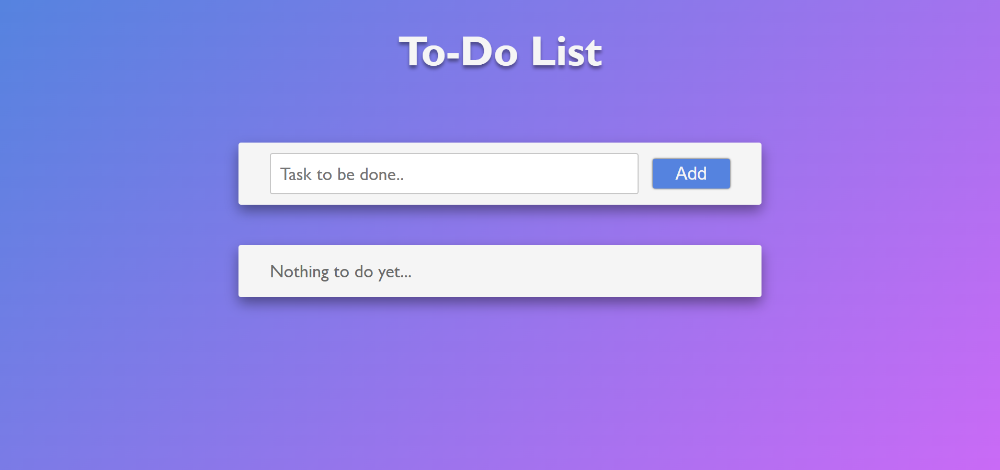
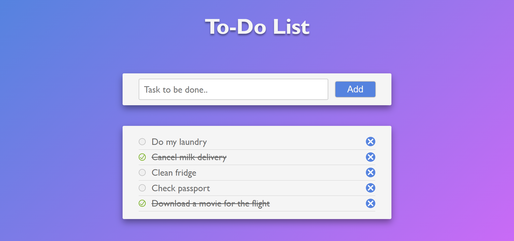

# To-Do List App

## Descripción

Esta es una aplicación de lista de tareas simple pero atractiva, desarrollada con HTML, CSS y JavaScript. Permite a los usuarios agregar tareas, marcarlas como completadas o desmarcarlas, y eliminarlas de la lista. Este proyecto fue realizado con el objetivo de practicar mis habilidades en desarrollo front-end.

## Características

- **Agregar tareas**: Puedes escribir una tarea en el campo de texto y agregarla a la lista haciendo clic en el botón correspondiente.
- **Marcar tareas como completadas**: Cada tarea tiene un ícono de círculo que, al hacer clic, marca la tarea como completada. Este estado es reversible, por lo que puedes desmarcarla si lo deseas.
- **Eliminar tareas**: Cada tarea tiene un ícono en forma de **X** que permite eliminarla de la lista.
- **Interfaz atractiva**: La aplicación cuenta con un diseño visual simple pero agradable utilizando CSS.

## Capturas de Pantalla




## Instalación

Sigue estos pasos para clonar y ejecutar el proyecto en tu máquina local:

1. Clona el repositorio:
   ```bash
   git clone https://github.com/tu_usuario/tu_repositorio.git

2. Navega hasta la carpeta del proyecto:
    ```bash
    cd tu_repositorio

3. Abre el archivo index.html en tu navegador favorito.

## Uso 

1. Escribe una tarea en el campo de texto.
2. Haz clic en el botón "Agregar" para añadir la tarea a la lista.
3. Marca la tarea como completada haciendo clic en el ícono de círculo.
4. Elimina la tarea haciendo clic en el ícono de papelera.

## Tecnologías Utilizadas 

- HTML
- CSS
- JavaScript

## Autor 

Este proyecto fue desarrollado por Carlos M. Hernández. Si tienes alguna pregunta o sugerencia, no dudes en contactarme.

## Licencia

Este proyecto está licenciado bajo la Licencia MIT - mira el archivo [LICENSE](./LICENSE) para más detalles.
